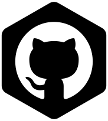
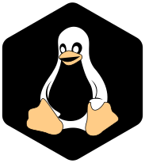
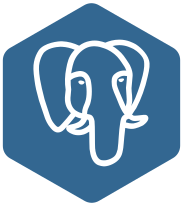
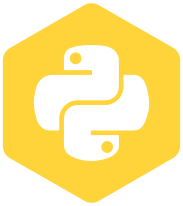

### Hi there, I'm Felipe Yamane - aka [FelipeYamane][website] 👋

## I'm a Husband, IT Analyst and Software Engineer Student at [PUC-PR][pucpr] !!
<!--
- 🔭 I just launched my first course: [Become A VS Code SuperHero!][course]!
- 🌱 I’m currently learning everything 🤣
- 👯 I’m looking to collaborate with other content creators
- 🥅 2020 Goals: Contribute more to Open Source projects
- ⚡ Fun fact: I love to draw and play guitar / drums
-->

### Connect with me:

[][website]
[][twitter]
[][linkedin]
[][instagram]
 
### Languages and Tools:

  
  
  
  
  
  
  
  
  

 

   
:zap: GitHub Stats
 
  

 

[website]: https://felipeyamane.com
[twitter]: https://twitter.com/felipeyamane
[instagram]: https://instagram.com/felipeyamane
[linkedin]: https://linkedin.com/in/felipeyamane
[pucpr]: https://www.pucpr.br
